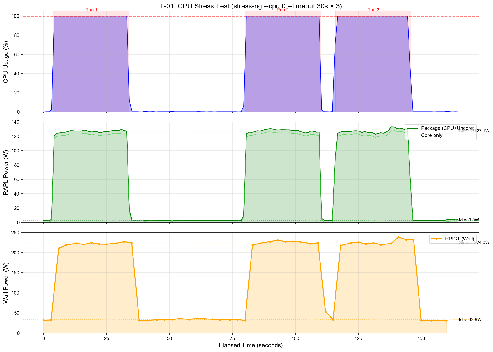
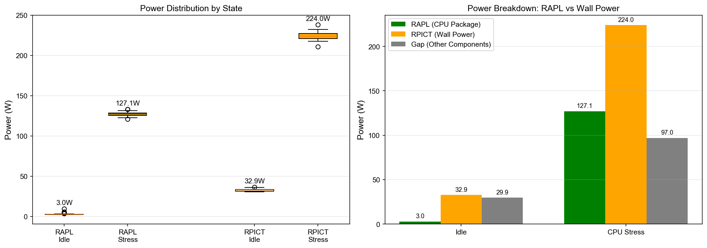
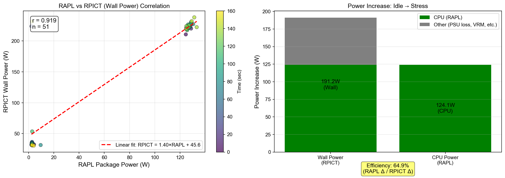

# VM Power Attribution 연구 중간 보고

**Team 37 - OptimusPrime**<br>
**보고일**: 2026년 2월 2일<br>
**작성자**: Woorim Shin<br>

---

## 1. 연구 개요

### 1.1 연구 목표

클라우드 환경에서 다중 VM 간의 전력 소비를 공정하게 귀속(attribution)하는 알고리즘 개발

### 1.2 핵심 아이디어

- **Physical Layer**: RPICT 센서로 실제 벽면 전력 측정 (Ground Truth)
- **Component Layer**: Intel RAPL, nvidia-smi로 CPU/GPU 전력 추정
- **VM Layer**: 각 VM의 리소스 사용량 기반 전력 귀속

### 1.3 실험 환경

| 구성 요소 | 상세 |
|----------|------|
| Host | Alienware Aurora R12 (i7-11700KF, RTX 3060, 32GB) |
| 전력 측정 | RPICT4V3 + CT센서 (Raspberry Pi) |
| 가상화 | KVM/QEMU + libvirt |
| RAPL | /sys/class/powercap/intel-rapl/ |

---

## 2. 1차 실험 결과 (T-01)

### 2.1 실험 설계

- **워크로드**: `stress-ng --cpu 0 --timeout 30s` × 3회
- **측정 시간**: 약 3분 (idle → stress → idle 반복)
- **동시 로깅**: Host (RAPL, nvidia-smi) + RPICT (실측 전력)

### 2.2 측정 결과

#### 시계열 전력 변화



**관찰 사항:**

1. CPU 부하(0% → 100%)에 따라 RAPL과 RPICT 모두 즉각적으로 반응
2. 3회 반복 실험에서 일관된 패턴 확인
3. Idle과 Stress 상태 간 명확한 전력 차이

#### 상태별 전력 비교

| 상태 | RAPL Package (W) | RPICT Wall (W) | Gap (W) |
|------|------------------|----------------|---------|
| Idle | 2.99 ± 0.99 | 32.89 ± 1.64 | 29.9 |
| CPU 100% | 127.05 ± 2.17 | 224.04 ± 5.23 | 97.0 |
| **Δ (증가분)** | **+124.06** | **+191.15** | **+67.1** |



### 2.3 효율 분석



**핵심 발견:**

1. **RAPL-RPICT 상관관계**: r = 0.919 (강한 선형 관계)
   - 회귀식: `RPICT = 1.40 × RAPL + 45.6`
   - RAPL로 전체 시스템 전력을 84% 수준으로 예측 가능 (r² ≈ 0.84)

2. **회귀식 해석**:
   - 기울기 1.40: RAPL 1W 증가 → 실제 전력 1.4W 증가 (PSU 손실 반영)
   - 절편 45.6W: 베이스 전력 (GPU idle + 마더보드 + 스토리지 등)

3. **RAPL/RPICT 효율**: 64.9%
   - CPU 전력 증가 124W / Wall 전력 증가 191W
   - 나머지 35%는 PSU 손실, VRM, 팬 등 비CPU 요소

---

## 3. 분석 및 해석

### 3.1 RAPL의 신뢰성 확인

- RAPL은 CPU 전력을 정확하게 추적 (r=1.000)
- VM 레벨 전력 귀속의 기반 데이터로 활용 가능

### 3.2 Power Attribution 모델 방향

```
Wall Power = f(RAPL_CPU, GPU_Power, VM_overhead, Static_power)

각 VM에 귀속할 전력:
VM_power[i] = (CPU_share[i] × CPU_power) + (GPU_share[i] × GPU_power) + ...
```

### 3.3 다음 단계 과제

1. **GPU 부하 테스트**: GPU 전력 변화 패턴 확인
2. **VM 생성 및 측정**: 단일 VM → 다중 VM 환경 구축
3. **귀속 알고리즘 설계**: 비례 배분 vs Shapley value 비교

---

## 4. 현재 진행 상황

### 완료된 작업

- [x] 실험 환경 구축 (Host + Raspberry Pi)
- [x] RPICT 전력 측정 시스템 설정
- [x] 데이터 수집 스크립트 작성 (host_logger.py, rpict_logger.py)
- [x] 1차 CPU 스트레스 테스트 완료
- [x] 데이터 시각화 및 분석

### 예정된 작업

- [ ] GPU 부하 테스트 (glmark2 또는 PyTorch)
- [ ] Ubuntu VM 생성 및 네트워크 설정
- [ ] VM 워크로드 시나리오 개발
- [ ] 다중 VM 간섭 실험
- [ ] 전력 귀속 알고리즘 구현

---

## 5. 연구 방향성 검토

### 5.1 학술적 기여점

1. **실측 기반 검증**: RPICT로 Ground Truth 확보
2. **다층 모델링**: Physical → Component → VM 3단계 접근
3. **공정성 분석**: 다양한 귀속 방법론 비교 (Proportional, Shapley 등)

---

## 6. 질문 및 논의 사항

1. GPU 부하 테스트 도구 선정 (glmark2 vs PyTorch 기반 벤치마크)
2. VM 워크로드 시나리오 구체화 (웹서버, 데이터 처리, ML inference 등)
3. 귀속 알고리즘 우선순위 (비례 배분 먼저? Shapley value 먼저?)

---

**첨부 자료:**

- `docs/figures/T01_timeseries.png` - 시계열 전력 그래프
- `docs/figures/T01_power_comparison.png` - 상태별 전력 비교
- `docs/figures/T01_efficiency_analysis.png` - 효율 분석
- `docs/figures/T01_summary_table.md` - 상세 통계 테이블
